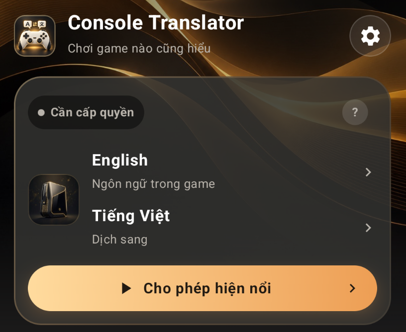
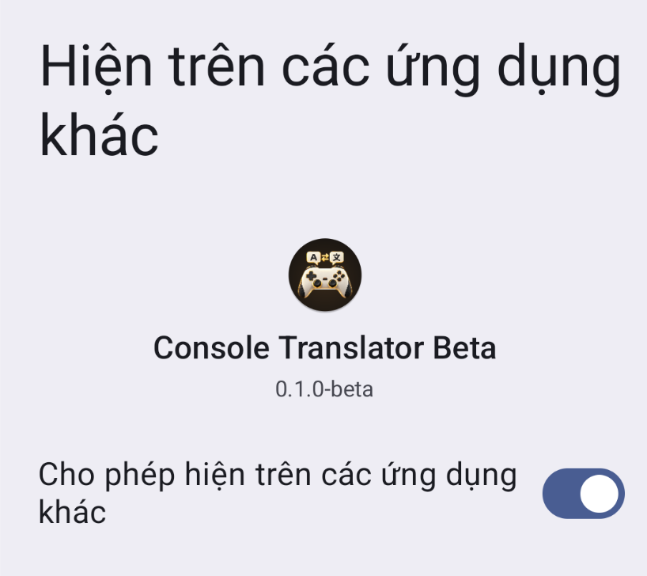
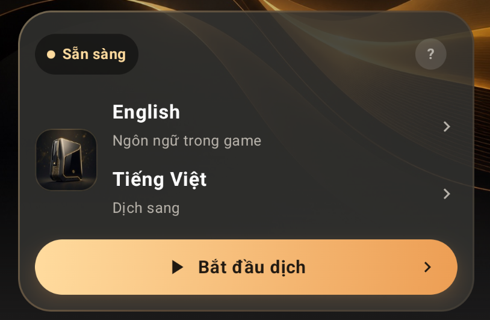
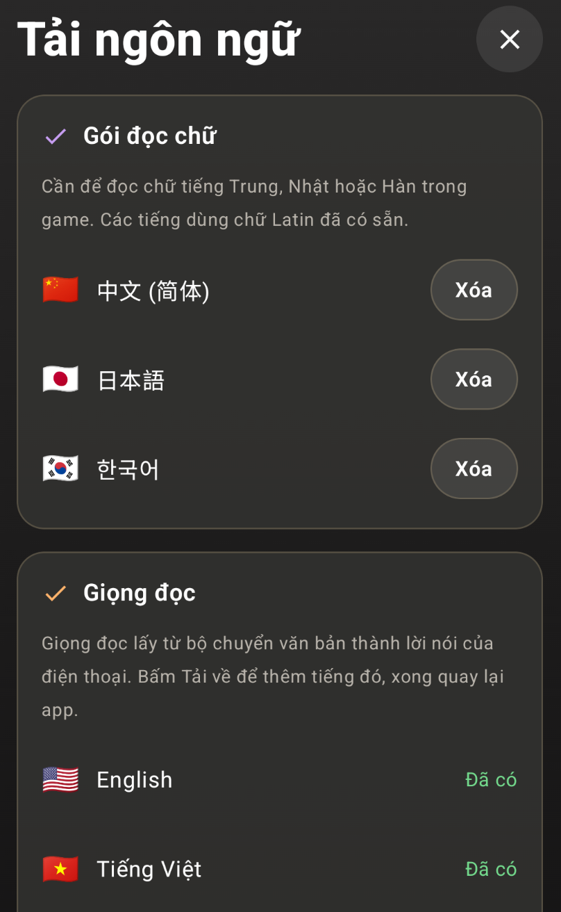
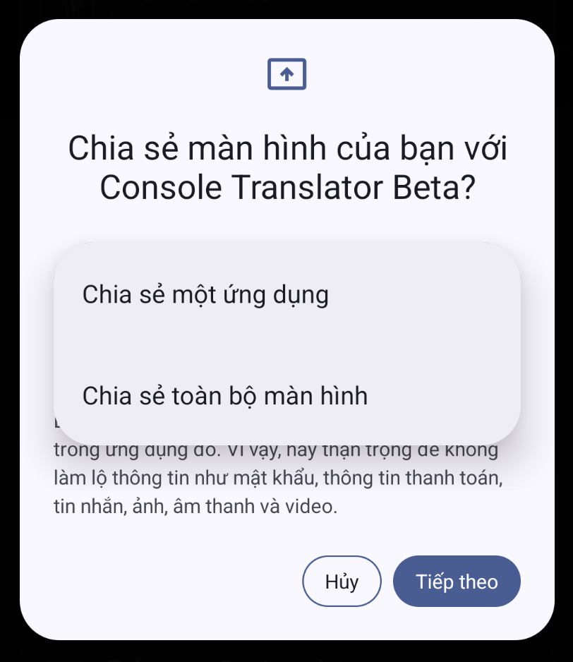
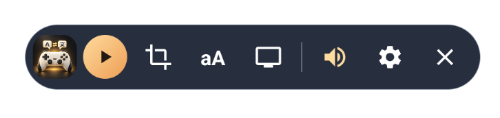

# Console Translator Android: hướng dẫn bằng hình

[Nhận APK và mã dùng thử](https://t.me/pstranslator) · [Xem hướng dẫn trên web](https://kyozxx.github.io/Console-Translator/guide.html)

Bật phụ đề trong game. Nếu dùng Remote Play, mở được hình game trên điện thoại trước.

## 1. Cấp quyền hiện nổi

Mở Console Translator, bấm **Cho phép hiện nổi**.

## 2. Bật quyền cho app

Nếu hiện danh sách ứng dụng, chọn **Console Translator Beta**. Bật **Cho phép hiện trên các ứng dụng khác**, rồi quay lại app.

## 3. Tải ngôn ngữ và giọng đọc

Chọn ngôn ngữ trong game và ngôn ngữ dịch sang, rồi bấm **Bắt đầu dịch**. Nếu app mở **Tải ngôn ngữ**, tải các gói còn thiếu.

Muốn nghe bản dịch, tải thêm giọng của ngôn ngữ dịch sang. Nếu hiện **Đã có** hoặc **Xóa** thì gói đó đã được tải. Xong, đóng màn hình này để quay lại.

Game tiếng Anh đã có bộ đọc chữ. Tiếng Trung, Nhật, Hàn cần tải thêm gói đọc chữ tương ứng; dịch trên máy cần gói dịch của cặp ngôn ngữ.

## 4. Chọn ứng dụng cần dịch

Bấm **Bắt đầu dịch** lần nữa. Khi Android hỏi, chọn **Chia sẻ một ứng dụng → Tiếp theo**, rồi chọn game hoặc app Remote Play đang dùng.

Chơi PX5: mở hình game bằng [PXPlay](https://play.google.com/store/apps/details?id=psplay.grill.com) trước, rồi chọn chia sẻ PXPlay. Đây là app trả phí riêng. Nếu Android chỉ có chia sẻ toàn màn hình, bạn có thể dùng lựa chọn đó.

## 5. Chọn vùng chữ, rồi chạy dịch

Bật phụ đề trong game. Bấm nút **khung quét**, kéo khung bao quanh chữ gốc và bấm **Xong**. Sau đó bấm **tam giác chạy** để bắt đầu dịch.

Các nút dưới đây được xếp từ trái sang phải như trong ảnh.

- **Logo app:** Bấm để thu gọn hoặc mở thanh nút. Giữ và kéo logo để di chuyển thanh.
- **Chạy / Tạm dừng:** Bấm nút tam giác để dịch; bấm lại để tạm dừng mà vẫn giữ thanh nổi.
- **Khung quét:** Chọn vùng có chữ gốc. Kéo để di chuyển, kéo góc để đổi kích thước, rồi bấm Xong.
- **aA · Kiểu phụ đề:** Đổi cỡ chữ, màu chữ, nền và bật/tắt hiển thị chữ gốc cùng bản dịch.
- **Màn hình TV:** Xem trạng thái và kết nối lại TV đã ghép. Ghép lần đầu trong Cài đặt → Phụ đề trên TV.
- **Loa · Đọc bản dịch:** Bật hoặc tắt đọc to. Dùng giọng của ngôn ngữ dịch sang đã tải trên điện thoại.
- **Bánh răng · Chỉnh nhanh:** Đổi cách dịch, phong cách, giọng đọc, tốc độ quét hoặc hồ sơ game. Có lối mở cài đặt đầy đủ.
- **Dấu X · Kết thúc:** Dừng phiên dịch và đóng thanh nổi. Muốn dịch lại, mở app và bấm Bắt đầu dịch.

## Hướng dẫn thêm

Phần cài APK, TV LG, Android TV và xử lý lỗi được thu gọn ở cuối [trang hướng dẫn](https://kyozxx.github.io/Console-Translator/guide.html).
